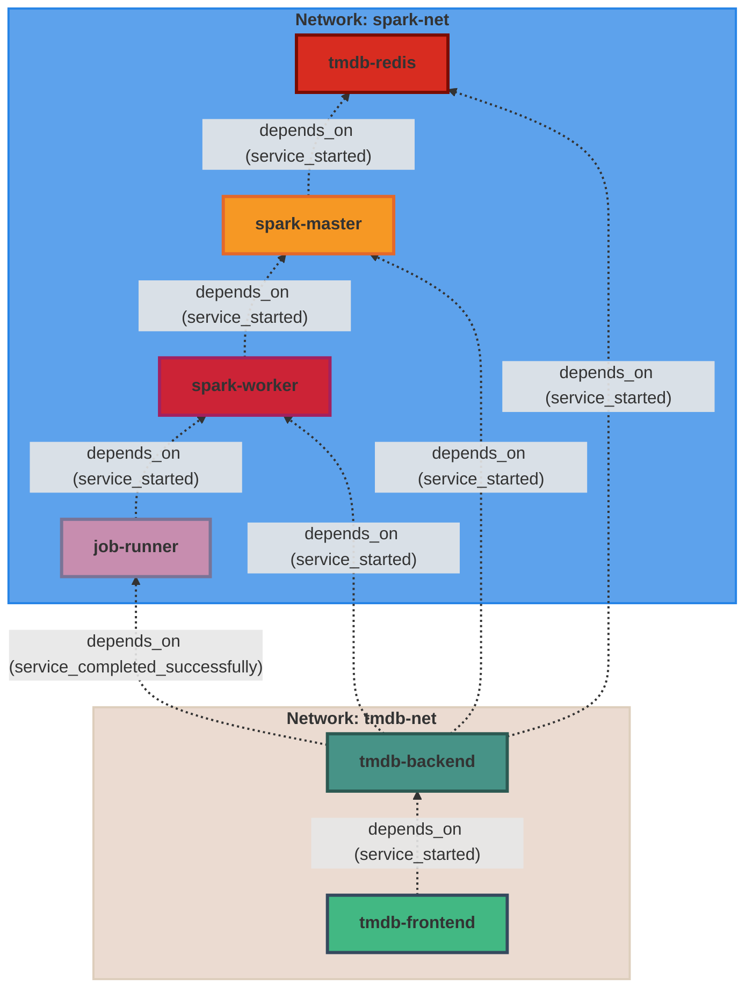

# TMDb Spark Recommendation Extension

## Structure



## Overview

This project demonstrates how to build a movie recommendation system using the Alternating Least Squares (ALS) algorithm from Spark/PySpark. It leverages the MovieLens dataset for collaborative filtering and enriches recommendations with metadata from the TMDb API. The system is containerized using Docker Compose for easy setup and reproducibility.

The frontend is implemented using Nuxt.js for a modern, performant user experience.

## Features

- Movie recommendations using Spark ALS
- Integration with TMDb API for movie metadata and posters
- FastAPI backend for API endpoints
- Chrome extension frontend for user interaction
- Nuxt.js web frontend for a modern UI
- Redis for caching and fast data access

## Requirements

- **TMDb API Key** and **API Read Access Token**
  - Add these to the `.env` file in the `backend/` directory:

    ```env
    TMDB_API_KEY=your_tmdb_api_key
    TMDB_BEARER_TOKEN=your_tmdb_bearer_token
    ```

 - **MovieLens Dataset**
   - Download the [MovieLens dataset](https://grouplens.org/datasets/movielens/). You can choose either the full dataset (`ml-latest`) for more data and better recommendations, or the small dataset (`ml-latest-small`) for faster setup and testing. Place your chosen dataset in `spark/data/`.

   - You can select which dataset to use by setting an environment variable (e.g., `dataset=normal` or `dataset=small`) in your `docker-compose.yaml` file. This allows you to switch datasets without changing code.

## Docker Compose Structure

```
services:
  redis:         # Redis cache for fast data access
  backend:       # FastAPI backend (Python)
  frontend:      # Nuxt.js frontend application
  spark-master:  # Spark master node
  spark-worker:  # Spark worker node
  job-runner:    # Runs Spark jobs and data loading scripts

networks:
  tmdb-net:      # Custom bridge network for all services
```

## Important Notes

- To get personalized recommendations, you should have rated movies in your TMDb account. The system fetches your ratings from TMDb to generate recommendations.
- You must add the Chrome extension (found in `frontend/extension/`) to your browser to interact with the system and authenticate with TMDb.

## Quick Start

1. Clone the repository:

   ```sh
   git clone https://github.com/mbofos01/tmdb-spark-recommendation-extension.git
   cd tmdb-spark-recommendation-extension
   ```

2. Add your TMDb API credentials to `backend/.env`.
3. Download and extract the MovieLens dataset into `spark/data/`.
4. Build and start the services:

   ```sh
   docker-compose up --scale spark-worker=2
   ```

5. Access the backend API at [http://localhost:8000](http://localhost:8000)
6. Use the Chrome extension frontend to interact with the system.

## Example Screenshot


## Credits

- **Author:** Michail Panagiotis Bofos (@mbofos01)
- **MovieLens Dataset:** [GroupLens Research](https://grouplens.org/datasets/movielens/)
- **TMDb API:** [The Movie Database (TMDb)](https://www.themoviedb.org/documentation/api)

## License

This project is for educational and demonstration purposes. Please respect the licenses of MovieLens and TMDb.
